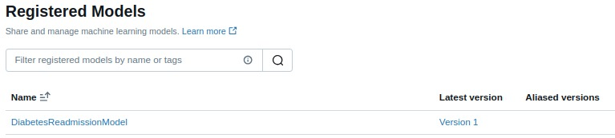

# 🧠 Proyecto MLOps - Predicción de Readmisión en Pacientes con Diabetes
## 1. 🎯 Introducción
Este proyecto tiene como objetivo construir una plataforma completa de MLOps que permita:

- Procesar y transformar datos clínicos con Apache Airflow.
- Entrenar y registrar un modelo predictivo con MLflow.
- Almacenar artefactos del modelo en MinIO.
- Desplegar una API de inferencia con FastAPI.
- Exponer métricas de inferencia a Prometheus.
- Visualizar el comportamiento del sistema en Grafana.
- Hacer pruebas de carga con Locust.
- Exponer el API con una interfaz de usuario Streamlit.

**El caso de uso se centra en la predicción de readmisión hospitalaria en pacientes con diabetes, utilizando el dataset público Diabetes 130-US hospitals.**

## 2. 🗂 Estructura de Archivos Principales

 📁 dags/
  ├── raw_to_clean_and_transform.py         # DAG ETL que limpia y transforma los datos
  ├── train_and_register.py                 # DAG que entrena el modelo y lo registra en MLflow

 📁 k8s/
  ├── airflow/                              # Despliegue de Airflow (deployment, jobs y servicios)
  ├── common/                               # Archivos comunes (PostgreSQL, MinIO)
  ├── inference-api/                        # Dockerfile e implementación de la API de inferencia
  ├── minio/                                # Archivos de despliegue para el servicio MinIO
  ├── mlflow/                               # Archivos de despliegue de MLflow y su servicio
  ├── observability/                        # Configuraciones de Prometheus y Grafana
  └── namespace.yml                         # Define el namespace del proyecto

recreate_all.sh                            # Despliegue completo desde cero
run_pipelines.sh                           # Corre los DAGs en secuencia
observabilidad.sh                          # Script para desplegar Prometheus, Grafana y API

## 3. 🛠 Airflow

- 📍 URL: http://localhost:8080

- 📦 DAGs implementados:

**raw_to_clean_and_transform.py**
Descarga los datos originales, los divide en train/val/test, los limpia y transforma.

**train_and_register.py**
Carga los datos desde Postgres, realiza un gridsearch manual con XGBoost, registra el mejor modelo en MLflow y lo pone en producción.

## 4. 📦 MLflow
- 📍 URL: http://localhost:5000
- Se usa como servidor de tracking.
- Registra parámetros, métricas, artefactos y versiones del modelo.
- El modelo se despliega en stage Production bajo el nombre "DiabetesReadmissionModel".

## 5. 🗄 MINIO

MinIO simula un servicio S3 local.
Se utiliza para almacenar los artefactos del modelo exportados desde MLflow.

 📁 Bucket creado: mlflow

**Credenciales por defecto:**

*AWS_ACCESS_KEY_ID=minioadmin*
*AWS_SECRET_ACCESS_KEY=minioadmin*

## 6. 🧪 Prueba de la API con curl

curl -X POST http://localhost:8081/predict \
  -H "Content-Type: application/json" \
  -d '{"instances":[{"time_in_hospital":3,"num_lab_procedures":45,"num_procedures":0,"num_medications":10,"number_outpatient":0,"number_emergency":0,"number_inpatient":1,"number_diagnoses":9,"age":60}]}'

**Output Esperado: {"predictions":[1]}**

**📍 La API responde en http://localhost:8081.**

## 7. 📈 Despliegue de Prometheus

**📍 URL: http://localhost:9090**

**Configurado para raspar métricas de:**
- inference-api.mlops-proyecto3.svc.cluster.local:80
- prometheus.mlops-proyecto3.svc.cluster.local:9090 (automonitoreo)

**Métricas recolectadas:**
- inference_requests_total
- inference_request_latency_seconds

## 8. 📊 Despliegue de Grafana

**📍 URL: http://localhost:3000**

*Usuario: admin, Contraseña: admin*

**Datasource configurado: Prometheus**

**Dashboard cargado automáticamente desde un ConfigMap, visualiza:**
- Total de inferencias
- Latencia media
- Inferencias por estado (success / error)

